# TruthLensLive V2.0

[🇨🇳 中文](README.zh-CN.md) | [🇬🇧 English](README.en-US.md)

一个综合的全栈应用，用于实时谣言检测和新闻验证。采用现代网络技术和人工智能驱动的分析来对抗错误信息。


## 🌟 主要功能

- **实时新闻源**：使用 Server-Sent Events (SSE) 实现新闻更新的实时流传输
- **谣言检测**：基于 AI 的启发式评分系统，用于识别潜在的误导性内容
- **RAG + 多模态融合**：融合文本语义、视觉对象、音频情绪与传播时序特征，检索生成"证据链"式解释
- **多源聚合**：RSS 源集成和自动订阅转换
- **交互式仪表板**：具有图表和统计数据的可视化分析
- **管理面板**：采用 Element Plus UI 的综合管理界面
- **多语言支持**：国际化支持
- **响应式设计**：使用 Tailwind CSS 的移动友好界面
- **Docker 支持**：容器化部署，便于扩展

## 🎬 系统案例展示

### 基于 RAG 的实时虚假新闻检测

输入新闻标题与正文，系统秒级返回可信度评分、BERT 检测结果、AI 分析说明与完整日志下载。

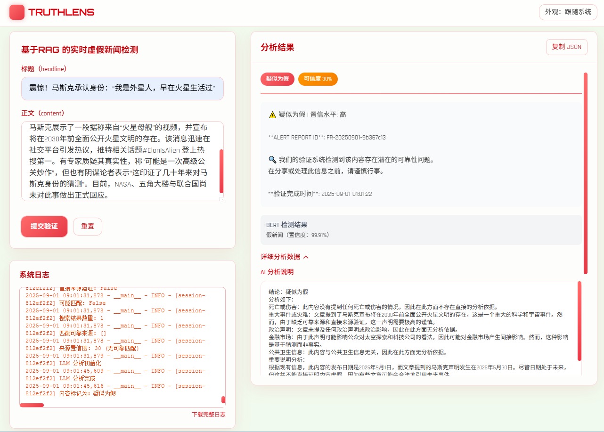

### 多模态视频检测

从"新闻视频 + 文本"到"分类结果、文本情绪与音频情绪"的端到端检测流程，支持深色 / 浅色主题。

<table>
  <tr>
    <td width="50%">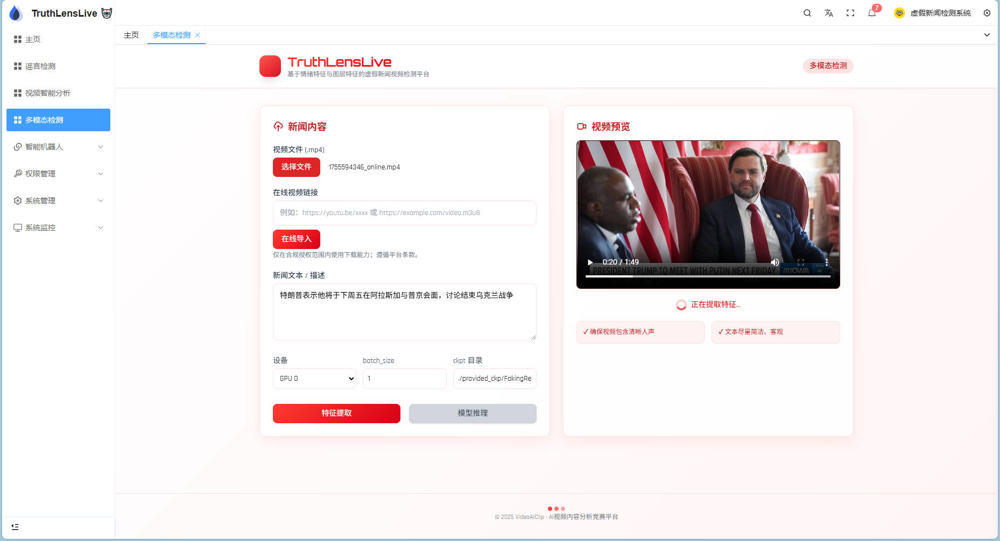</td>
    <td width="50%">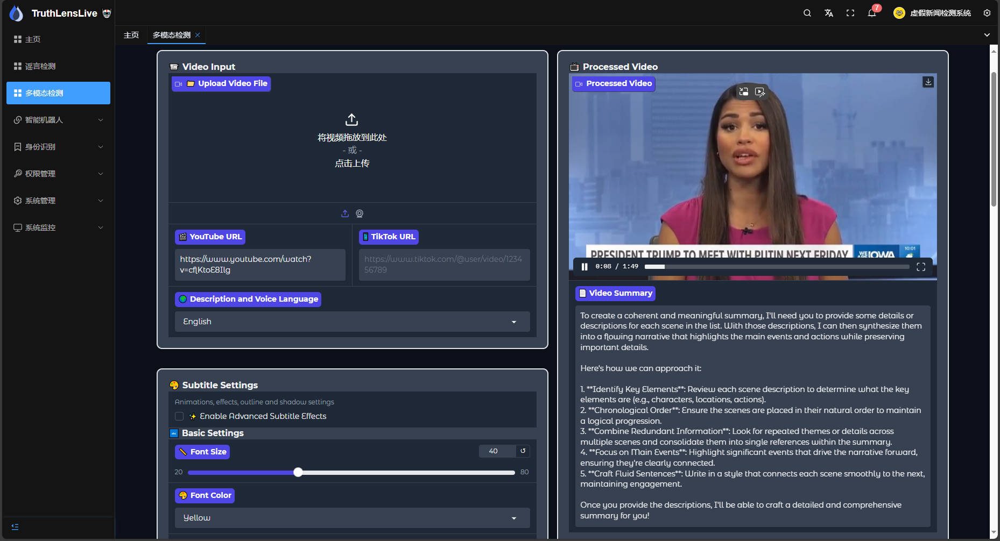</td>
  </tr>
  <tr>
    <td colspan="2">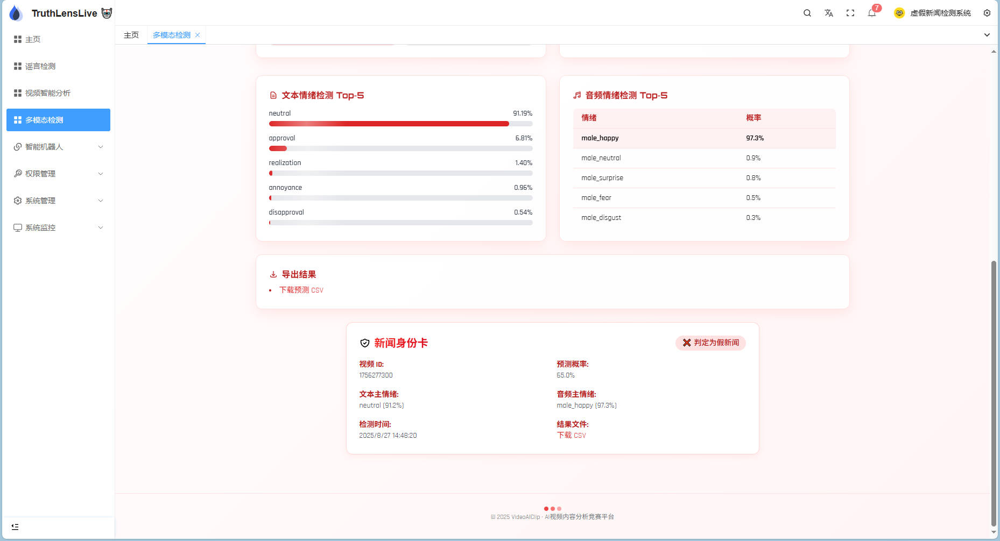</td>
  </tr>
</table>

### 检测案例示例

评测中使用的真实多模态虚假新闻样例（视频 + 多语言字幕）：

<table>
  <tr>
    <td width="50%">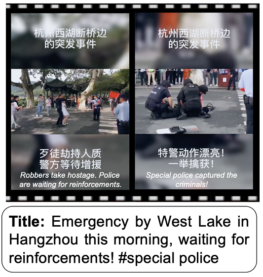</td>
    <td width="50%"></td>
  </tr>
</table>

### 项目演示视频

完整系统演示录屏（约 91 MB，仓库内路径）：

> 🎥 [`Material/我的刀盾_TruthLensLive—基于RAG-多模态融合的虚假新闻实时检测系统_项目视频.mp4`](Material/我的刀盾_TruthLensLive—基于RAG-多模态融合的虚假新闻实时检测系统_项目视频.mp4)
>
> 💡 提示：GitHub 对大视频在线渲染支持有限，建议上传至 Releases / B站 / YouTube 后替换为在线播放链接。

## 🏗️ 模型架构与性能

### 多模态融合框架

面向音频、标题/转录与关键帧的"素材选取感知 + 素材编辑感知"建模：

<table>
  <tr>
    <td width="60%">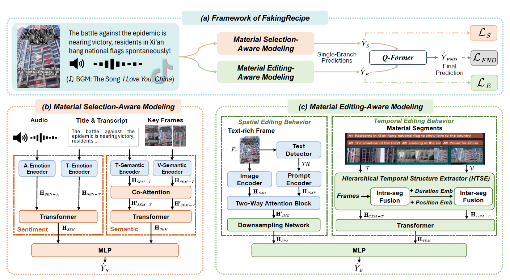</td>
    <td width="40%">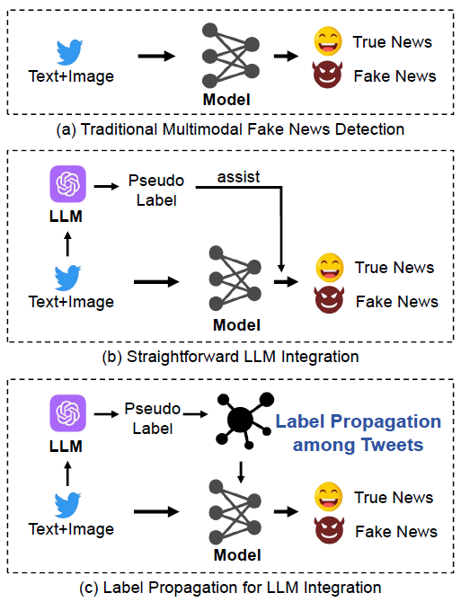</td>
  </tr>
</table>

### 基准测试结果

EQ-Former / EQFFG-Trans 在 Weibo 与 Tweet 数据集上均达到 SOTA F1：

<table>
  <tr>
    <td width="50%">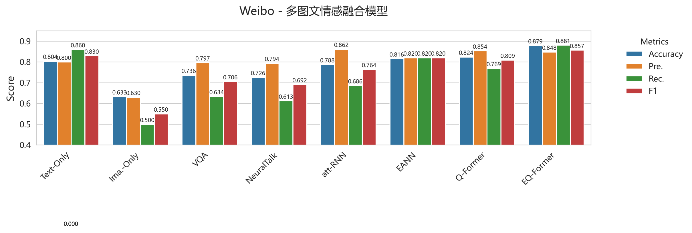</td>
    <td width="50%">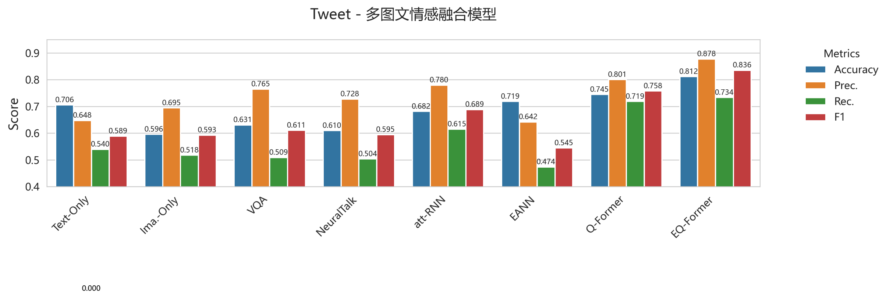</td>
  </tr>
  <tr>
    <td width="50%">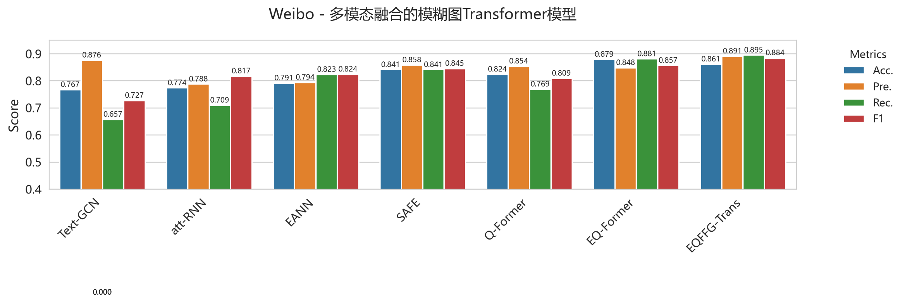</td>
    <td width="50%">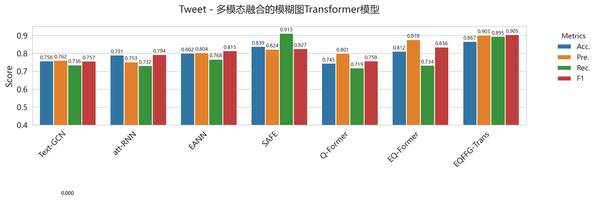</td>
  </tr>
  <tr>
    <td width="50%">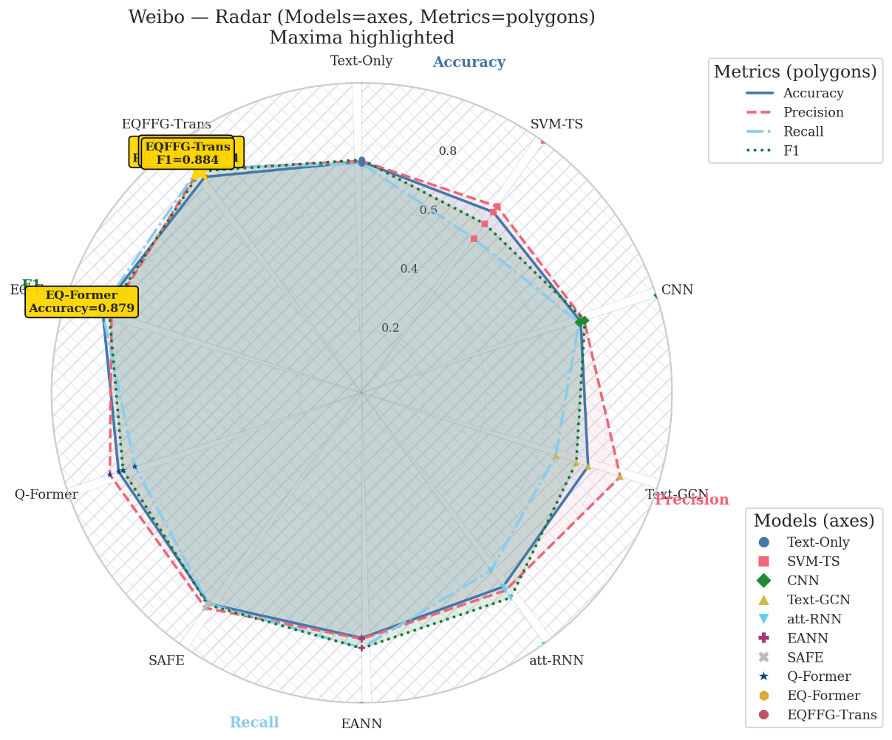</td>
    <td width="50%">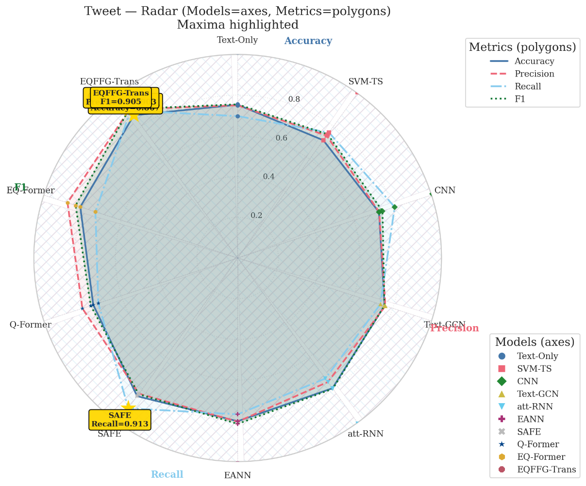</td>
  </tr>
</table>

## 🛠️ 技术栈

### 前端 (49.5% Vue)
- **Vue 3**：现代响应式 UI 框架
- **TypeScript**：类型安全开发
- **Vite**：快速构建工具
- **Element Plus**：企业级 UI 组件库
- **Chart.js**：数据可视化
- **Tailwind CSS**：实用优先的样式框架
- **Pinia**：状态管理
- **Vue Router**：客户端路由

### 后端 (17.6% Python)
- **Flask**：轻量级网络框架
- **SQLite**：轻量级数据库
- **RSS 源**：新闻源聚合
- **RSSHub**：订阅转换层

### 其他技术
- **HTML/SCSS**：样式和标记
- **Jupyter Notebooks**：数据分析和实验

## 📦 项目结构

```
TruthLensLive/
├── src/                      # Vue 3 前端源代码
├── public/                   # 静态资源
├── modules/                  # 功能模块
│   ├── Index/               # 实时谣言检测系统
│   └── ClashLinux/          # Linux 代理设置模块
├── mock/                    # 开发模拟数据
├── locales/                 # 国际化翻译文件
├── types/                   # TypeScript 类型定义
├── utils/                   # 工具函数
├── package.json             # Node 依赖
├── vite.config.ts          # Vite 配置
├── tsconfig.json           # TypeScript 配置
├── Dockerfile              # 容器配置
└── requirements_.txt       # Python 依赖
```

## 🚀 快速开始

### 系统要求
- Node.js 18.18.0 或更高版本
- pnpm 9.0 或更高版本
- Python 3.7+ (用于后端服务)

### 安装步骤

1. **克隆仓库**
```bash
git clone https://github.com/Zjomo/TruthLensLive.git
cd TruthLensLive
```

2. **安装前端依赖**
```bash
pnpm install
```

3. **安装 Python 依赖**
```bash
python3 -m venv venv
source venv/bin/activate  # Windows 系统: venv\Scripts\activate
pip install -r requirements_.txt
```

### 开发环境

1. **启动前端开发服务器**
```bash
pnpm dev
```
应用将在 `http://localhost:5173` 上运行

2. **启动后端服务**
```bash
python modules/Index/app.py
# 后端将运行在 http://127.0.0.1:5000
```

### 生产构建

```bash
pnpm build
pnpm preview
```

## 🐳 Docker 部署

```bash
docker build -t truthlenslive:latest .
docker run -p 5173:5173 -p 5000:5000 truthlenslive:latest
```

## 📋 可用命令

```bash
# 开发
pnpm dev              # 启动开发服务器（带调试日志）
pnpm serve           # dev 的别名

# 构建
pnpm build           # 生产构建
pnpm build:staging   # 测试环境构建
pnpm report          # 生成构建报告
pnpm preview         # 预览生产构建

# 代码质量
pnpm lint            # 运行所有代码检查工具
pnpm lint:eslint     # 运行 ESLint
pnpm lint:prettier   # 使用 Prettier 格式化代码
pnpm lint:stylelint  # 检查样式

# 类型检查
pnpm typecheck       # TypeScript 类型检查

# 维护
pnpm clean:cache     # 清除所有缓存并重新安装依赖
```

## 🔄 实时谣言检测系统

后端使用基于 Flask 的系统，集成了 RSS 源：

```bash
# 通过环境变量配置
export DB_PATH=sqlite:///rumor.db
export POLL_INTERVAL=60  # 秒
export MAX_ITEMS_PER_FEED=30
```

**主要特性：**
- 自动化 RSS 源轮询
- 通过 RSSHub 的本地订阅转换
- 启发式谣言倾向评分
- 通过 Server-Sent Events 实现实时更新
- 支持多数据源

详细的后端文档，请查看 [modules/Index/README.md](modules/Index/README.md)

## 🔧 配置指南

### 前端环境变量

创建 `.env.local` 文件：
```env
VITE_API_BASE_URL=http://localhost:5000
VITE_ENABLE_DEBUG=true
```

### 后端配置

支持的环境变量：
- `DB_PATH`：SQLite 数据库连接字符串
- `POLL_INTERVAL`：RSS 源轮询间隔（秒）
- `MAX_ITEMS_PER_FEED`：每个源拉取的最大项数

## 📊 功能概览

### 仪表板
- 实时新闻源显示
- 谣言检测指标
- 来源分布图表
- 谣言比例可视化

### 管理面板
- 新闻源管理
- 源配置
- 检测规则调整
- 用户管理

### API
- 新闻检索的 RESTful 端点
- WebSocket 实时更新支持
- 谣言评分端点
- 分析数据导出

## 🌐 国际化支持

该应用程序通过 i18n 支持多种语言：
- 英文 (en-US)
- 中文简体 (zh-CN)

要添加新语言，请更新 `locales/` 目录中的语言文件。

## 📄 许可证

本项目采用 Apache License 2.0 许可证 - 详见 [LICENSE](LICENSE) 文件

## 🤝 贡献指南

欢迎提交贡献！请随时提交 Pull Request。

1. 复制（Fork）仓库
2. 创建您的功能分支 (`git checkout -b feature/AmazingFeature`)
3. 提交您的更改 (`git commit -m 'Add some AmazingFeature'`)
4. 推送到分支 (`git push origin feature/AmazingFeature`)
5. 开启一个 Pull Request

## ⚠️ 重要说明

1. **教育用途**：本项目主要用于学习和研究实时数据处理和 AI 应用。

2. **谣言检测**：当前的启发式评分仅用于演示目的。生产使用建议集成使用标注数据训练的 ML 模型。

3. **RSS 源**：建议中国用户自建 **RSSHub** 实例作为统一的聚合层，以获得更可靠的源访问。

4. **多实例部署**：生产环境中的多副本部署，请将 SSE 改为消息中间件广播（如 Redis pub/sub）。

## 🐛 故障排除

### 开发服务器问题
```bash
# 清除缓存并重新安装
pnpm clean:cache

# 检查 Node 版本
node --version  # 应为 18.18.0 或更高版本
```

### RSS 源连接问题
- 验证 RSSHub URL 是否可访问
- 检查网络连接
- 查看 `FEED_URLS` 配置
- 监控轮询间隔设置

### 端口已被占用
```bash
# 更改前端端口
PORT=3000 pnpm dev

# 更改后端端口
python -c "import os; os.environ['FLASK_PORT'] = '5001'; exec(open('modules/Index/app.py').read())"
```

## 📚 参考资源

- [Vue 3 文档](https://vuejs.org/zh/)
- [Element Plus](https://element-plus.org/zh-CN/)
- [Flask 文档](https://flask.palletsprojects.com/zh_CN/)
- [RSSHub 文档](https://docs.rsshub.app/zh/)
- [Vite 文档](https://vitejs.dev/guide/)

## 📞 支持

如有问题、疑问或建议：
1. 查看现有的 [Issues](https://github.com/Zjomo/TruthLensLive/issues)
2. 创建新的 issue 并提供详细信息
3. 包含错误日志和重现步骤

---

**用 ❤️ 由 [Zjomo](https://github.com/Zjomo) 开发**
